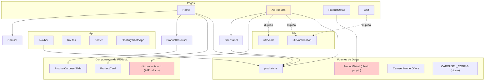

# Papelería Store — Estructura y Análisis de Mejoras

Este documento describe la estructura actual del proyecto, identifica áreas de oportunidad y propone mejoras para tener una base más sólida y preparada para un panel de control (CMS).

---

## 📊 Diagrama de Estructura Actual

```
┌─────────────────────────────────────────────────────────────────────────────────────────┐
│                                    APP (React + Vite)                                     │
└─────────────────────────────────────────────────────────────────────────────────────────┘
                                          │
                    ┌─────────────────────┼─────────────────────┐
                    ▼                     ▼                     ▼
            ┌───────────────┐    ┌───────────────┐    ┌───────────────┐
            │   Navbar      │    │    Routes     │    │    Footer     │
            │   (siempre)   │    │               │    │   (siempre)   │
            └───────┬───────┘    └───────┬───────┘    └───────────────┘
                    │                    │
        ┌───────────┼───────────┐        │
        ▼           ▼           ▼       │
  SearchBar   CategoryDropdown  Cart   ┌─┴──────────────────────────────────────────────┐
  (products)  (CATEGORIES)     Icon   │                                                  │
                                      │  / (Home)          /all-products (AllProducts)   │
                                      │  /product/:id     /cart (Cart)                   │
                                      │                                                  │
                                      └──────────────────────┬───────────────────────────┘
                                                             │
┌─────────────────────────────────────────────────────────────────────────────────────────┐
│                           PÁGINAS Y SUS DEPENDENCIAS                                     │
└─────────────────────────────────────────────────────────────────────────────────────────┘

┌─────────────────────────────────────────────────────────────────────────────────────────┐
│  HOME                                                                                    │
│  ├── Carusel (type="banner")  ← datos hardcodeados (bannerOffers)                        │
│  ├── ProductCarousel ×3      ← productos filtrados de products.ts                     │
│  │   └── ProductCarouselSlide ← usa CAROUSEL_CONFIG (hardcodeado en Home)               │
│  └── products-content-area   ← ProductCard ×8 (⚠️ TODOS muestran featuredProducts[0])   │
└─────────────────────────────────────────────────────────────────────────────────────────┘

┌─────────────────────────────────────────────────────────────────────────────────────────┐
│  ALL PRODUCTS                                                                            │
│  ├── FilterPanel           ← filtros (brands, mayoreo, menudeo, priceRange)             │
│  └── all-products-grid     ← productos inline (⚠️ NO usa ProductCard)                   │
│      └── div.product-card  ← tarjeta HTML manual con data-* para filtros DOM            │
│      └── addProductToCart  ← ⚠️ duplicado, no usa utils/cart                            │
│      └── showNotification  ← ⚠️ duplicado, no usa utils/notification                   │
└─────────────────────────────────────────────────────────────────────────────────────────┘

┌─────────────────────────────────────────────────────────────────────────────────────────┐
│  PRODUCT DETAIL                                                                          │
│  └── products: {...}      ← ⚠️ datos propios hardcodeados, NO usa data/products.ts     │
└─────────────────────────────────────────────────────────────────────────────────────────┘

┌─────────────────────────────────────────────────────────────────────────────────────────┐
│  CART                                                                                    │
│  └── showNotification     ← ⚠️ duplicado (mismo código que utils/notification)         │
└─────────────────────────────────────────────────────────────────────────────────────────┘

┌─────────────────────────────────────────────────────────────────────────────────────────┐
│  FUENTES DE DATOS (inconsistencia)                                                       │
├─────────────────────────────────────────────────────────────────────────────────────────┤
│  • data/products.ts        → Home, AllProducts, Navbar, FilterPanel                      │
│  • ProductDetail products  → Objeto propio con 3 productos (id 1,2,3)                   │
│  • Carusel bannerOffers    → Array hardcodeado en Carusel.tsx                            │
│  • CAROUSEL_CONFIG         → Objeto en Home.tsx (badges por id)                           │
│  • CATEGORIES              → Navbar (CategoryDropdown)                                   │
└─────────────────────────────────────────────────────────────────────────────────────────┘

┌─────────────────────────────────────────────────────────────────────────────────────────┐
│  COMPONENTES DE PRODUCTO (3 implementaciones distintas)                                  │
├─────────────────────────────────────────────────────────────────────────────────────────┤
│  1. ProductCarouselSlide   → Para carruseles (clase product-card-carousel)               │
│  2. ProductCard            → Reutilizable (clase product-card) — Home lo usa mal        │
│  3. div.product-card       → AllProducts: HTML inline con emojis por id                    │
└─────────────────────────────────────────────────────────────────────────────────────────┘

┌─────────────────────────────────────────────────────────────────────────────────────────┐
│  CARrito Y NOTIFICACIONES (lógica duplicada)                                            │
├─────────────────────────────────────────────────────────────────────────────────────────┤
│  • utils/cart.addProductToCart   → Home, ProductDetail (NO AllProducts)                 │
│  • utils/cart.syncCartCount      → Home                                                   │
│  • AllProducts.addProductToCart  → Implementación propia (merge duplicados)               │
│  • utils/notification            → usada por cart.ts                                     │
│  • Cart.showNotification         → Código duplicado                                       │
│  • Navbar useNotification        → Componente Notification (React)                       │
└─────────────────────────────────────────────────────────────────────────────────────────┘

┌─────────────────────────────────────────────────────────────────────────────────────────┐
│  FILTROS (AllProducts)                                                                   │
├─────────────────────────────────────────────────────────────────────────────────────────┤
│  • FilterPanel actualiza FilterState                                                     │
│  • applyFilters usa document.querySelectorAll + classList.add/remove                     │
│  • ⚠️ Enfoque imperativo (DOM) en lugar de declarativo (React)                           │
└─────────────────────────────────────────────────────────────────────────────────────────┘
```

---

## 🔍 Diagrama Mermaid (visual)



---

## 📋 Áreas de Oportunidad

### 1. **Duplicación de código**✅
| Ubicación | Problema |
|-----------|----------|
| `AllProducts` | `addProductToCart` y `showNotification` duplicados |
| `Cart` | `showNotification` duplicado |
| `ProductDetail` | Productos propios en lugar de `products.ts` |

### 2. **Componentes de producto inconsistentes**
- **ProductCarouselSlide**: Para carrusel (estilos `product-card-carousel`)
- **ProductCard**: Componente reutilizable, pero AllProducts no lo usa
- **AllProducts**: Tarjeta inline con emojis por `product.id` (1→✒️, 2→📓, etc.)

### 3. **Datos fragmentados** ✅
- `products.ts`: 10 productos
- `ProductDetail`: 3 productos hardcodeados
- `Carusel`: 7 banners hardcodeados
- `CAROUSEL_CONFIG`: Solo en Home

### 4. **Filtros con manipulación DOM**
- `applyFilters` usa `querySelectorAll` y `classList.add/remove`
- Debería filtrar en React: `filteredProducts = products.filter(...)` y re-renderizar

### 5. **Home: grid de productos**
- 8 `ProductCard` mostrando el mismo producto (`featuredProducts[0]`)
- Parece inacabado o placeholder

### 6. **Carrito**
- `utils/cart.addProductToCart` no agrupa duplicados (siempre push)
- `AllProducts.addProductToCart` sí agrupa por nombre+precio
- `syncCartCount` usa `cart.length` en lugar de suma de cantidades

### 7. **Estilos dispersos**
- CSS por página: `home.css`, `allproducts.css`, `cart.css`, etc.
- Varias clases similares: `product-card`, `product-card-carousel`, `product-placeholder`

---

## 🛠️ Lo que se puede hacer ahora

### Corto plazo (refactor sin panel)
1. **Unificar lógica de carrito**: Usar `utils/cart` en AllProducts y corregir merge de duplicados.
2. **Unificar notificaciones**: Usar `utils/notification` o el componente `Notification` en Cart.
3. **AllProducts con ProductCard**: Sustituir el div inline por `ProductCard` y filtrar con React.
4. **ProductDetail con products.ts**: Obtener producto por id desde `products.ts`; si no existe, 404.
5. **Corregir Home grid**: Mostrar productos variados (ej. `featuredProducts` o `products.slice(0,8)`).

### Medio plazo (estructura más sólida)
1. **Extraer configuraciones**: `CAROUSEL_CONFIG`, `FEATURED_IDS`, banners → `data/` o `config/`.
2. **Hook useCart**: Centralizar carrito (localStorage + listeners) para toda la app.
3. **Contexto de productos**: `ProductContext` para evitar pasar `products` por muchas capas.
4. **API de productos**: Función `getProductById(id)` en `data/products.ts`.

---

## 🎛️ Preparación para panel de control (CMS)

Para que la página sea modificable desde un panel:

### 1. Capa de configuración
```
src/
  config/
    home-sections.ts    # Secciones de Home (orden, visibilidad, títulos)
    carousel-banners.ts # Banners del carrusel principal
    featured-products.ts# IDs destacados
```

### 2. Modelo de datos para CMS
```typescript
// Ejemplo: secciones de Home editables
interface HomeSectionConfig {
  id: string
  type: 'carousel' | 'grid' | 'banner'
  title?: string
  productIds?: number[]
  category?: string
  limit?: number
  visible: boolean
  order: number
}
```

### 3. Arquitectura objetivo
```
┌─────────────────┐     ┌─────────────────┐     ┌─────────────────┐
│  Panel Admin    │────▶│  API / JSON     │────▶│  React App      │
│  (futuro)       │     │  Config         │     │  (lee config)   │
└─────────────────┘     └─────────────────┘     └─────────────────┘
```

### 4. Pasos concretos
1. Extraer todo lo hardcodeado a archivos de config.
2. Crear `useHomeConfig()` que lea la config (por ahora desde JSON local).
3. Más adelante: API REST o Firebase para que el panel guarde la config.
4. Componentes que reciban `config` como props y no datos fijos.

---

## 📁 Estructura de carpetas recomendada

```
src/
├── app/                    # App, Router, providers
├── config/                 # Configuración editable (preparado para CMS)
│   ├── home-sections.ts
│   ├── banners.ts
│   └── carousel-config.ts
├── data/                   # Datos estáticos (productos, categorías)
├── features/               # Por dominio (opcional)
│   ├── products/
│   │   ├── components/
│   │   ├── hooks/
│   │   └── types/
│   ├── cart/
│   └── filters/
├── components/             # Componentes compartidos
│   ├── product/           # ProductCard, ProductCarouselSlide, etc.
│   └── ui/
├── pages/
├── hooks/
├── utils/
├── types/
└── styles/
```

---

## ✅ Resumen ejecutivo

| Aspecto | Estado actual | Acción prioritaria |
|---------|---------------|---------------------|
| Fuente de datos | Fragmentada | Unificar en `products.ts` y config |
| Componentes producto | 3 variantes | Usar `ProductCard` en AllProducts |
| Carrito | Lógica duplicada | Centralizar en `utils/cart` |
| Notificaciones | 3 implementaciones | Usar `utils/notification` o componente React |
| Filtros | Manipulación DOM | Filtrar en React con estado |
| Home grid | Mismo producto ×8 | Mostrar productos variados |
| Preparación CMS | Nada | Extraer config a archivos dedicados |

---

*Documento generado como guía para refactor y evolución del proyecto Papelería Store.*
